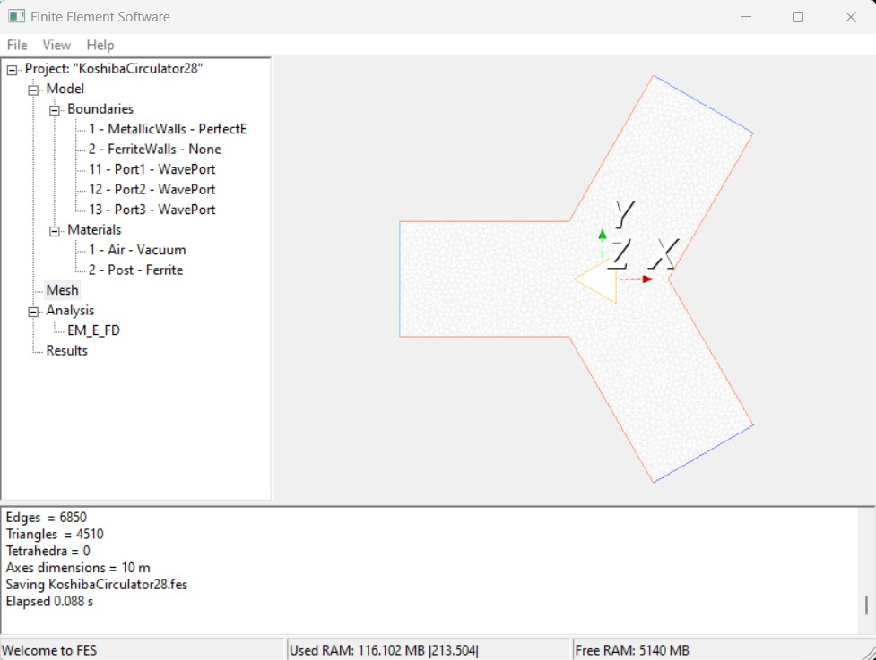

# wxFES
A wxWidgets + VTK experiment extending FES

# How-to
To get started, clone the repository. Then run Maker.bat in windows terminal and type:
- 'mingw32-make' to start compilation; 
- 'mingw32-make test' for testing 

# Release
- Download [x86_64-w64-mingw32](https://github.com/ntilau/uni-phd-wxfes/raw/master/bin/wxfes.exe) build

# Screenshots
